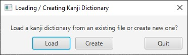
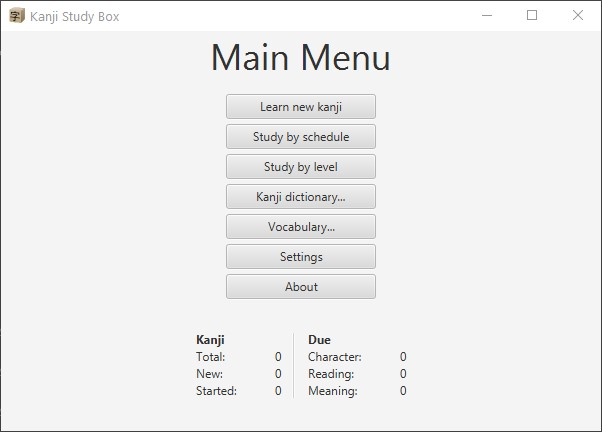
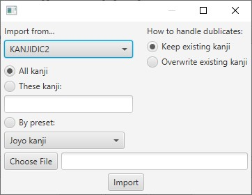
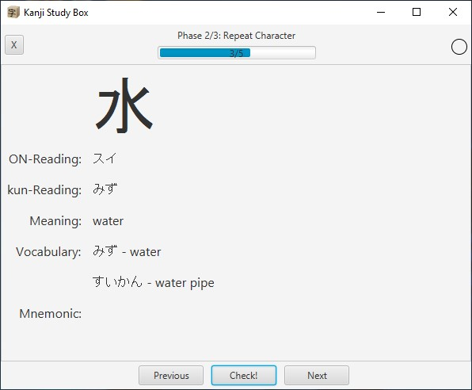
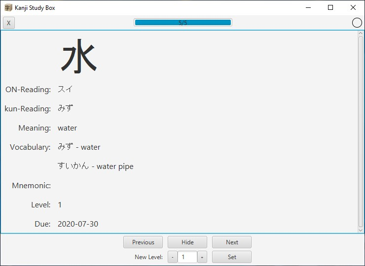
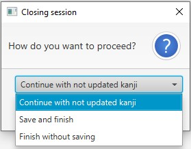
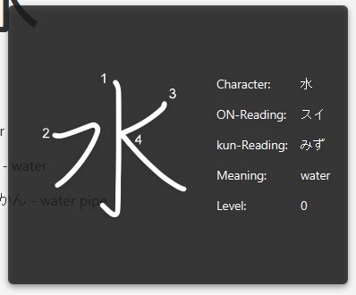
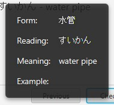

<h1>  Kanji Study Box</h1>

1. [ Overview ](#overview)
2. [ How to Start Studying ](#how-to-start-studying)
3. [ Third Party Copyright Notices and Licenses ](#third-party-copyright-notices-and-licenses)

## Overview

Kanji Study Box is a WIP desktop application for memorizing kanji by spatial repetition. It works similar to a highly specialized flashcard system (Leitner system).

Every kanji is represented as an item consisting of three features: character, reading and meaning. Study progress is tracked via levels and scheduling is based on those levels, meaning they correspond to the boxes of real-world flashcard systems.

There is an import function for the free kanji dictionary KANJIDIC2, which provides a quick and easy alternative to creating study material manually. It can be downloaded from https://www.edrdg.org/wiki/index.php/KANJIDIC_Project.

The application also comes with stroke order diagrams that can be displayed during study.

The project uses JavaFX 11 and JDK 11 and is managed with Maven.

Major To-Dos:
1. Separate scheduling and progress data from dictionary into decks
2. Make the amount of levels and the associated scheduling customizable (planned as a feature of the decks)
3. Make study directions customizable (planned as a feature of the decks)

## How to Start Studying

### Creating the Dictionary Files
The first time you start up the application you will be prompted to create your first kanji and vocabulary dictionary files respectively.

Save them to a place of your choice. You can change their paths at any point from the Settings view that is accessible from the main menu.

### Adding Kanji Data

#### Creating Kanji Manually

In the main menu, click on "Kanji dictionary..." to add or import the kanji you want to study.
Adding kanji manually:

A kanji object consists out of its character, on-readings, kun-readings, meanings and a mnemonic. The application will allow you to create kanji by filling in only the character field, but it's highly recommended to at least provide one reading and a meaning. Otherwise you will essentially end up with flashcards with one side that is blank. The mnemonic is completely optional.

#### Importing Kanji

You can import kanji data either from an existing Kanji Study Box Kanji Dictionary file or from KANJIDIC2. If you don't need all kanji, you can specify which kanji to import by choosing "These kanji" and providing a non-separated string containing the desired kanji. In the case of KANJIDIC2 you can also chose from a set of presets (Joyo kanji, JLPT levels).

After creating or importing a kanji, its levels (= its study progress) are set to 0 and its scheduling is inactive (technically, it is scheduled to a point very far in the future). The sorting of the kanji dictionary determines the order in which you will learn them. If you want to change the order you can do that either manually by clicking "Edit..." or by clicking on "Change order". From "Change order" you can either give a non-separated string of kanji that the dictionary should be sorted after or import a sorting from another dictionary or KANJIDIC2, which provides orderings from a set of lexicons and other study material.

Don't forget to save in the end.

#### Adding Kanji Vocabulary

If you want example vocabulary to be displayed during study, go to "Vocabulary...". From there you can add vocabulary manually in the same fashion as for the kanji dictionary. Similar to kanji, the only field that is required to create a vocable is its form.

### Start Learning

By clicking "Learning new kanji" in the main menu, you can start studying the kanji you just added. Specify the amount of new kanji you want to learn and click "Start studying".

When learning a new kanji, you go through three phases. The first phase is for memorizing all the features of the kanji, the second phase is for recalling the character and the third phase for recalling the readings and meanings. Click "Check!" if you recalled correctly. Otherwise, just click next. The kanji will be shown to you again.

After passing all three phases you'll have the option to schedule the kanji for study. Their levels will be set to 1 and they'll be scheduled for repetition the same day.

### Study Kanji

To study kanji that are due, click on "Study kanji". After that, choose the feature (character, reading, meaning) that you want to study. 

The progress is tracked via levels. Every feature has a separate level. Currently there are 14 levels (excluding 0 which is for kanji that aren't started yet). The higher the level, the more spaced-out the scheduling gets. The scheduling is measured in days and follows the Fibonacci sequence, starting from "1, 3, 5, ...".

After clicking on "Show" you can choose a new level for the kanji and press "Set" to update it. It will be scheduled automatically. If you failed to recall the kanji, just press next. After going through all kanji, you can repeat all kanji you haven't updated by choosing "Continue with not updated kanji".

If you don't want to study readings and meanings separately, just ignore the progress/scheduling for meaning.

### Tooltips

There are two types of tooltips: one for kanji which are mainly meant to display stroke order and one for vocables to display their kanji. Just hover over the kanji / vocable and wait for a moment for the tooltip to appear.

## Third Party Copyright Notices and Licenses

### Kanji Stroke Order Font v4.003

This project uses the Kanji Stroke Order Font v4.003 from http://nihilist.org.uk which is based on kanji stroke order diagrams that are under the copyright of Ulrich Apel and the AAAA and Wadoku projects.

Copyright (C) 2004-2020 Ulrich Apel, the AAAA project and the Wadoku project
All rights reserved.

Redistribution and use in source and binary forms, with or without
modification, are permitted provided that the following conditions
are met:

1. Redistributions of source code must retain the above copyright
   notice, this list of conditions and the following disclaimer.
2. Redistributions in binary form must reproduce the above copyright
   notice, this list of conditions and the following disclaimer in the
   documentation and/or other materials provided with the distribution.
3. Neither the name of the author may be used to endorse or promote products
   derived from this software without specific prior written permission.

THIS SOFTWARE IS PROVIDED BY THE AUTHOR ``AS IS'' AND ANY EXPRESS OR
IMPLIED WARRANTIES, INCLUDING, BUT NOT LIMITED TO, THE IMPLIED WARRANTIES
OF MERCHANTABILITY AND FITNESS FOR A PARTICULAR PURPOSE ARE DISCLAIMED.
IN NO EVENT SHALL THE AUTHOR BE LIABLE FOR ANY DIRECT, INDIRECT,
INCIDENTAL, SPECIAL, EXEMPLARY, OR CONSEQUENTIAL DAMAGES (INCLUDING, BUT
NOT LIMITED TO, PROCUREMENT OF SUBSTITUTE GOODS OR SERVICES; LOSS OF USE,
DATA, OR PROFITS; OR BUSINESS INTERRUPTION) HOWEVER CAUSED AND ON ANY
THEORY OF LIABILITY, WHETHER IN CONTRACT, STRICT LIABILITY, OR TORT
(INCLUDING NEGLIGENCE OR OTHERWISE) ARISING IN ANY WAY OUT OF THE USE OF
THIS SOFTWARE, EVEN IF ADVISED OF THE POSSIBILITY OF SUCH DAMAGE.
